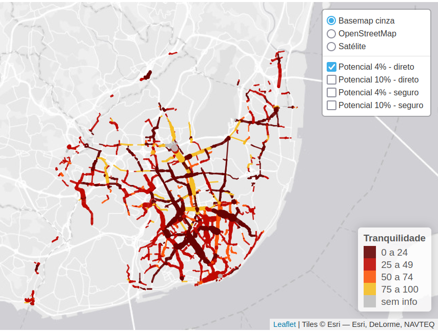
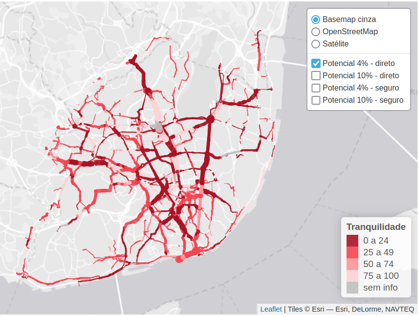
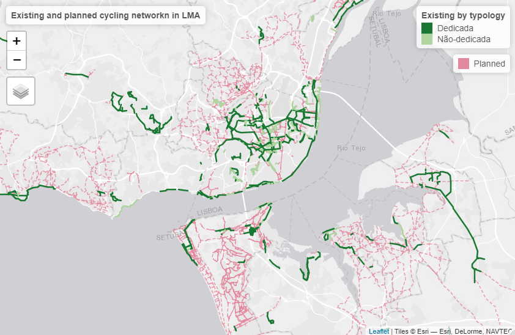

<!-- README.md is generated from README.Rmd. Please edit that file -->

```{r, include = FALSE}
knitr::opts_chunk$set(
  collapse = TRUE,
  comment = "#>",
  fig.path = "man/figures/README-",
  echo = FALSE,
  message = FALSE,
  warning = FALSE,
  out.width = "100%"
)
```

<!-- README.md is generated from README.Rmd. Please edit that file -->

```{r, include = FALSE}
library(sf)
```

# biclaR

<!-- badges: start -->

<!-- badges: end -->

**biclaR** is a tool for the design and assessment of different scenarios of the cycling network models in the Lisbon metropolitan area (LMA).
The web application can be found at [u-shift.github.io/biclarwww](https://u-shift.github.io/biclarwww/).

**biclaR** is an open source project, see the source code on [github.com/U-Shift/biclar](https://github.com/U-Shift/biclar).

For a description of the methods and research underlying the project, see the [paper](https://www.sciencedirect.com/science/article/pii/S0198971524001595) "Reproducible methods for modeling combined public transport and cycling trips and associated benefits: Evidence from the biclaR tool" published in *Computers, Environment and Urban Systems* [@felix_reproducible_2025], and the methodological report [PT] on the [TML website](https://www.tmlmobilidade.pt/projetos-e-atividades/planos-e-estudos/rede-ciclavel-metropolitana-estudo-modelacao-e-ferramenta-de-apoio-ao-planeamento-e-decisao/).

# Input data

The key datasets are as follows:

-   Trips dataset with Origin and Destination, at *Freguesia* level, disaggregated by transport mode, from @IMOB\
-   [CAOP 2020](https://www.dgterritorio.gov.pt/cartografia/cartografia-tematica/caop?language=en) - Official limits of Portuguese areas.
-   Road network from [OpenStreetMap](https://www.openstreetmap.org/#map=11/38.7053/-9.1585)\
-   Main public transport interfaces at Lisbon Metropolitan Area, provided by [Transportes Metropolitanos de Lisboa](https://www.tmlmobilidade.pt/)

# Cenarios for cycling uptake

## Baseline

The baseline scenario makes use of the 2018 mobility survey data in LMA.\
We considered all trips between *Freguesias*.

<!-- todo: include map of baseline scenario -->

See vignette [baseline scenario](articles/0_baseline_scenario.html) to see how this was modeled.

## ENMAC targets

The National targets for cycling uptake were set to:

-   4% of all trips should be made by bicycle by 2025
-   10% of all trips should be made by bicycle by 2030

Cycling trips should replace car trips directly.

See vignette [ENMAC scenario](articles/1_emnac_scenario.html) to see how this was modeled.

## Intermodal trips

See vignette [Intermodal scenario](articles/2_intermodal_scenario.html) to see how this was modeled.

## E-bikes investment policy

See vignette [E-bike scenario](articles/3_ebikes_scenario.html) to see how this was modeled.

# Methods

## PCT - Propensity to Cycle Tool

`biclar` uses the methods developed in [PCT.bike](https://pct.bike) [@Lovelace2017] for cycling uptake estimation and data visualization.

## Jittering

For the disagregation of OD pairs at *Freguesias* level, we use [OD Jittering](https://github.com/atumworld/odrust) [@Jittering2022] method, which better suits walking and cycling trips modelling (shorter distances), instead of relying on centroids that concentrate all the trips between areas.

The OD datasets, before and after jittering, are shown below.

```{r}
od_all = readRDS("TRIPSmode_freguesias.Rds")
zones = readRDS("FREGUESIASgeo.Rds")
od_all_sf = od::od_to_sf(od_all, zones)
od_all_jittered = readRDS("od_all_jittered_50.Rds")
```

```{r jitteredoverview, out.width="50%", fig.show='hold'}
plot(od_all_sf$geometry, lwd = 0.2)
plot(od_all_jittered$geometry, lwd = 0.1)
```

## Cycling routes

Use of [CyclingStreets.net](https://cyclinstreets.net) ([R package](https://rpackage.cyclestreets.net/)) for fast and quiet bike routes for baseline scenario.

For e-bike scenario, we developed a proper algorithm, considering the topography, and using [`slopes`](https://docs.ropensci.org/slopes) package.

## Intermodal trips

We made use and developed a [methodology](https://github.com/npct/rail) that considers replacing long trips by bike + train or ferry trips.

## Estimation of socioeconomic benefits

Health Economic Assessment Tool ([HEAT v5.0](https://www.heatwalkingcycling.org/#how_heat_works)) for walking and cycling by WHO.

# Results

## Cycling uptake in LMA and by Municipality

#### ENMAC Scenario up to 5km

See [here](https://u-shift.github.io/biclarwww/aml/mapa_cenario1.html) for full map.

<!--iframe src="https://u-shift.github.io/biclarwww/lisboa/mapa_cenario1.html" width="800" height="400px" data-external="1"-->

<!--/iframe-->



See [here](https://u-shift.github.io/biclarwww/) for results for each Municipality.

#### ENMAC Scenario up to 10km (E-bike)

See [here](https://u-shift.github.io/biclarwww/aml/mapa_cenario2.html) for full map.

<!--iframe src="https://u-shift.github.io/biclarwww/lisboa/mapa_cenario2.html" width="800" height="400px" data-external="1"-->

<!--/iframe-->



#### Intermodality Scenario

See [here](https://u-shift.github.io/biclarwww/aml/mapa_cenario3.html) for full map.

<!--iframe src="https://u-shift.github.io/biclarwww/lisboa/mapa_cenario3.html" width="800" height="400px" data-external="1"-->

<!--/iframe-->


## Comparision with the cycling network plans by Municipality

Compare the modeled cycling networks (segments overlapping) with expansion plans, by municipality.

<!-- todo: this is too heavy -->

```{r eval=FALSE, message=FALSE, warning=FALSE, include=FALSE}
planned_network = sf::st_read("https://github.com/U-Shift/biclar/releases/download/0.0.1/CyclingPlans2021.gpkg", quiet = TRUE)

existing_network = sf::st_read("https://github.com/U-Shift/biclar/releases/download/0.0.1/CyclingNetwork2021.gpkg", quiet = TRUE)

greens2 = c("#1A7832", "#AFD4A0") #color pal

library(tmap)
tmap_mode("view")
tm_layout(title = "Existing and planned cycling networkn in LMA", panel.show = T) +
  tm_add_legend("fill",
                labels = "Planned",
                col = "#E3879E",
                z = 3) +
tm_shape(planned_network) +
  tm_sf(lwd = 1.5,
        #   color = "pink",
        col = "#E3879E",
        lty = "dashed",
        alpha = 0.8 ,
        legend.show = T,
        title.col = "Planned") +
tm_shape(existing_network) +
  tm_sf(col = "Tipologia",
           lwd = 2.5,
           palette = greens2,
        title.col = "Existing by typology",
        popup.vars = c(
      "Município" = "Municipio",
      "Tipologia" = "Tipologia",
      "Função" = "Funcao",      
     "Sentido" = "Sentido", 
     "Comprimento" = "Lenght", 
     "ID" = "ID"
    ),
  )

```

```{r echo=FALSE}

```

We can view it in an [interactive map here](https://ushift.tecnico.ulisboa.pt/content/tml/RedeExistentePrevista.html).

# Funding

This project is funded by [TML - Transportes Metropolitanos de Lisboa](https://www.tmlmobilidade.pt/projetos-e-atividades/planos-e-estudos/rede-ciclavel-metropolitana-estudo-modelacao-e-ferramenta-de-apoio-ao-planeamento-e-decisao/).

# References {.unnumbered}
