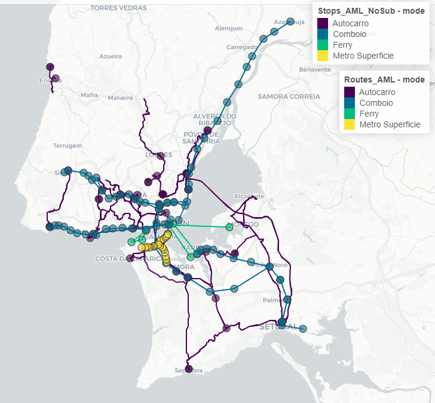
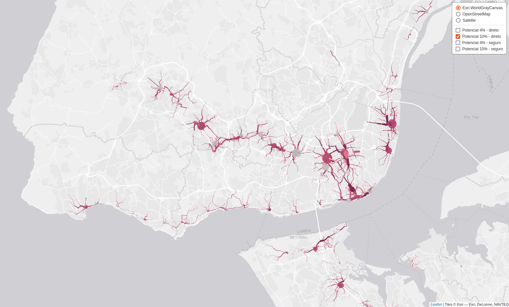
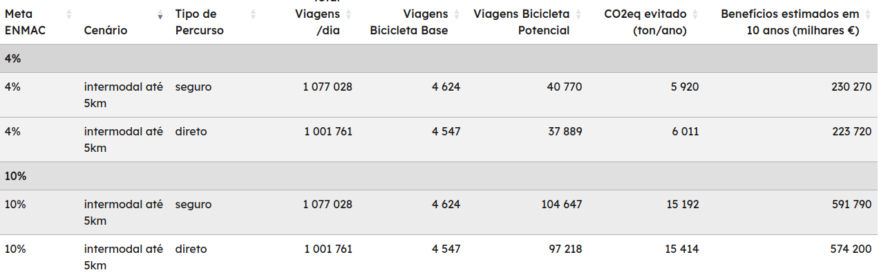
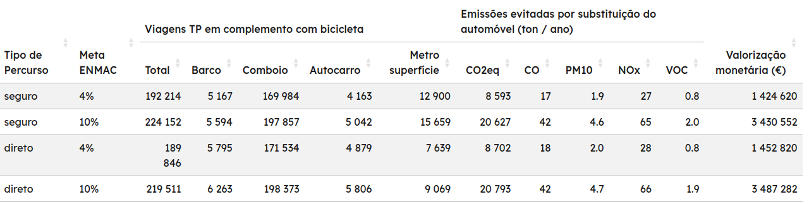

```{r setup, include=FALSE}
knitr::opts_chunk$set(echo = FALSE,
                      out.extra = "")  # This forces knitr to label all figures.
```

# Introduction

**full paper**: 4-6 pages in length (typically up to 3,000 words).

In metropolitan areas, car trips can be replaced by a combination of public transit (PT) and cycling for the first-and-last mile. This approach requires interventions and programs to make bicycling more appealing, and the resulting public investments can have significant social and environmental benefits. This paper focuses on estimating the potential for cycling + PT as a substitute for car trips in the Lisbon metropolitan area (LMA) and assessing its socio-environmental impacts using open data and open source tools.

According to the latest mobility survey conducted in 2018, the LMA registered a total of 5.3 million daily trips, with only 0.5% by bicycle. Car modal share is 58.4%, while PT accounts for 15.5%.
To achieve the cycling targets set by the Portuguese national cycling strategy for 2025 and 2030 (4% and 10%, respectively), the Department of Transport introduced biclaR, a decision support tool that facilitates the design and development of a metropolitan cycling network. 

This research aims to present and discuss the methods used to estimate…

Propensity to Cycle Tool

adding up an intermodality scenario to estimate cycling potential to public transit interfaces, and thus to support planning and prioritize investments in the cycling network.


# Methods

## Case Study

As características das viagens do IMob, constituem o cenário base deste projeto. Este inquérito à mobilidade foi realizado em 2017. Apesar de ter sido realizado em período pré-pandemia, este conjunto de dados é a melhor e mais recente informação que temos em termos de mobilidade urbana nas áreas metropolitanas.

Segundo o IMob (2017), das cerca de 5.3 milhões de viagens diárias na área metropolitana de Lisboa, apenas
25 479 das viagens são realizadas em bicicleta (0,5%), enquanto 3.1 milhões são feitas em automóvel (58.4%),
1.3 milhões a pé (23.9%), 825 mil em transportes públicos (15.5%) e 96 mil em outros modos (1.8%).

O número de viagens intramunicipais - ou que são realizadas com origem e destino no mesmo município (3.5
milhões viagens) - é superior ao número de viagens intermunicipais - com origem e destino em municípios
diferentes (1.8 milhões viagens). O automóvel e os transportes públicos são os modos maioritariamente
utilizados em viagens intermunicipais. O automóvel é o modo mais utilizado em qualquer tipologia de viagem.

Este é o cenário base, ou de referência, utilizado apenas para comparação com os cenários seguintes - de onde advém o potencial ciclável.

## Modeling Origin-Destination trips

imob data

Aplicou-se um método de desagregação das origens e destinos das viagens entre o centróide de uma freguesia para o centróide de outra freguesia, para que uma freguesia não esteja representada apenas por um único local de origem e destino das suas viagens (centróides).

Ao agregar as viagens todas em centróides, tornamos o exercício menos realista pois elimina um conjunto
importante de viagens de curta distância, o que é uma característica de viagens em modos ativos [@ef1, @ref2]. Para tal, recorreu-se ao método OD Jittering, que utiliza uma desagregação de um único ponto (por exemplo o centróide de uma área) em vários pontos aleatórios da rede viária existente, com
base no OpenStreetMap, e divide o volume de viagens dessa freguesia pelos pares origem-destino gerados
aleatoriamente.

Para este projeto, utilizou-se um nível de desagregação máxima de 100 viagens por par O-D. Isto significa que, por exemplo, para um par O-D de 2.000 viagens entre duas freguesias ligadas entre os seus centróides, o método jittering dispersa aleatoriamente as 2.000 viagens em 20 pares de 100 viagens entre 20 origens e 20 destinos nas duas freguesias.

A figura 3 ilustra a diferença entre a representação de viagens utilizando o método tradicional de ligação entre um único local entre cada freguesia, e a representação com a aleatorização e desagregação de viagens entre freguesias, para a área metropolitana de Lisboa.
Figura 3 - Representação de pares OD na área metropolitana de Lisboa entre freguesias, sem jittering (à esquerda), e com jittering (à direita).

O resultado da utilização deste método, em vez do tradicional uso de centróides de grandes áreas, é que torna mais realistas a representação de viagens realizadas, não correspondendo, no entanto, aos pares O-D reais das viagens realizadas (por motivos de proteção de dados definidos pelo INE).
Para uma melhor compreensão do método utilizado, consultar Jittering: A Computationally Efficient Method for
Generating Realistic Route Networks from Origin-Destination Data (Lovelace, Félix, and Carlino 2022)

## Modeling routes

A identificação dos percursos entre as origens e destinos (para as linhas de desejo) são um aspeto fundamental da modelação da rede ciclável nesta metodologia, uma vez que o IMob não identifica os percursos realizados por cada viagem, sendo necessário estimá-los. A respetiva modelação depende do cenário escolhido e tem em conta toda a restante informação disponível (como os declives, ou localização de interfaces de transporte público), para além da informação viária base.

A partir das linhas de desejo do cenário base, traçam-se os percursos modelados para o modo ciclável com base na rede viária (equivalente à afetação das viagens à rede, 4.º e último passo do modelo clássico dos 4 passos em sistemas de transportes). A modelação dos percursos cicláveis depende das variáveis consideradas, assim como das restrições pré-definidas. Estas restrições podem privilegiar aspetos como velocidade e volumes baixos, rotas mais diretas, percursos menos declivosos, entre outros, adequados à utilização da bicicleta, sendo que o algoritmo segue uma avaliação que resulta da ponderação das variáveis consideradas. Mesmo o percurso menos declivoso, mas com maior volume de tráfego, poderá ser o indicado se a função assim o definir.

O algoritmo de escolha de percurso escolhido foi o do r5r que é um algoritmo que permite muita flexibilidade nas configurações de tipo de percursos estimados, nomeadamente por permitir estimar com probabilidade e incerteza os percursos que usam transportes públicos (considerando os seus horários). O r5r permite a identificação de percursos mais diretos ou mais seguros, recorrendo para isso ao nível de stress de tráfego (Level of Traffic Stress, ou LTS), que varia de 1 a 4, sendo o 1 mais tranquilo - correspondendo, por exemplo, a pistas cicláveis fora de estrada, e o 4 menos tranquilo - correspondendo, por exemplo, a percursos que partilham o tráfego motorizado.
Os percursos foram estimados para o cenário base, para ambos os tipos de rede, direto e seguro, usando para isso o LTS 4 e LTS 3 respetivamente.

O nível de tranquilidade^[see https://www.cyclestreets.net/help/journey/howitworks/#quietness] é outro indicador estimado pelo CycleStreets para cada troço, com base no número de vias, velocidade máxima permitida, arborização, hierarquia e tráfego (quando a informação correspondente existe nas etiquetas do OpenStreetMap). É apresentado numa escala de 0 a 100, em que o zero corresponde ao nível menos seguro para se circular de bicicleta, e o 100 ao nível mais seguro e tranquilo - normalmente correspondendo a troços que incluem já infraestrutura ciclável segregada do tráfego motorizado.

Foi utilizado um modelo digital do terreno de 25m de resolução espacial e erro médio de altimetria vertical de 2.12m8 em Portugal, da Agência Espacial Europeia, na sua missão COPERNICUS, para incluir impedâncias 9 de declives no modelo.
O modelo r5r utiliza a rede viária do OpenStreetMap (extraída a 22 de outubro 2022), e os dados de GTFS criados e validados para o efeito.
Foi estimado o número de viagens em bicicleta potencial para as duas metas ENMAC (5% e 10%) a partir dos valores de viagens em bicicleta e em automóvel (como condutor e como passageiro) do cenário base de 2017.

Os percursos ou rotas foram depois sobrepostos e agregados por segmentos, juntando a informação de várias rotas que se sobrepõem em certos segmentos (overline). Por exemplo, foram somados os volumes de viagens em bicicleta estimados e a transferência do automóvel, e foi feita a média da velocidade automóvel e do nível de tranquilidade, ponderadas pela distância dos segmentos.


## Modeling intermodality

The intermodality scenario considers trips that can combine PT and cycling for the first-and-last legs. Conservatively, we considered the sum of first-and-last legs up to 5 km. Furthermore, we restricted PT use to unimodal trips without transfers (although they can be included in future modeling). [@bib2, @felix2023]

Finally, we only included PT modes that can practically accommodate bicycles, such as trains, ferries, trams, and intermunicipal bus lines with bike racks (\ \ref{fig:map1}).

Foram recolhidos os dados de transportes públicos da AML, em formato GTFS, tendo sido necessário o trabalho de limpeza, união, e validação prévio. Esta informação é indispensável para saber que terminais de transporte público (TP) se ligam a que origens ou destinos, e em que horários, para não se considerar de forma generalista que uma interface se liga a todo o sistema e que pode servir todas as viagens (origens e destinos), o que não seria realista.

```{r map1, out.width="60%", fig.cap="Interfaces and lines considered, by transport mode, in the Lisbon metropolitan area"}

```

To obtain reliable results, we used the OpenStreetMap road network and GTFS data. The r5r R package estimated the trip duration and distance for both the original modes and the bicycle + PT combination, while the od jittering R package estimated the OD locations based on a centroid-based OD matrix.

Para a modelação dos percursos definiu-se como janela temporal viagens até 120 minutos (2h). Para além disso considerou-se como duração máxima 25 minutos em bicicleta.

Map result (\ \ref{fig:map2}).

```{r map2, out.width="80%", fig.cap="Bike routes with highest potential to serve as first and last mile when replacing cycling and PT from car trips (screenshot of the interactive online tool)."}

```

## Assessing socio-environmental benefits

Socio-environmental impacts were assessed using the HEAT for Cycling and the HEAT as a Service^[see https://github.com/HEAT-WHO/HEAT_heatr_api] tools, from the WHO. Additionally, we estimate the impacts of shifting car trips to PT for the second leg of the journey with EMEP/EEA’s COPERT methodology and monetize them with the EU Guide to cost-benefit analysis.

Como referido na introdução, a ferramenta biclaR pretende estimar os impactes sociais e ambientais associados ao potencial ciclável dos vários cenários analisados. O horizonte temporal considerado para esta análise foi o curto prazo (i.e., 1 ano) e o longo prazo (i.e., 10 anos). Os impactes foram avaliados para cada cenário e para diferentes escalas territoriais:

* Desagregado à escala municipal para cada segmento de rede:
  + Ambientais (emissões de CO~2~eq evitadas);
  + Balanço monetarizado dos impactes socioeconómicos totais (considerando o balanço dos impactes ambientais e sociais);
* Agregado à escala metropolitana:
  + Ambientais (emissões de CO~2~eq evitadas);
  + Balanço monetarizado dos impactes socioeconómicos totais (considerando o balanço dos impactes ambientais e sociais);
  + Ambientais (emissões de CO~2~eq, CO, PM10, NOx, e VOC11, evitadas por substituição dos modos motorizados, considerando as emissões geradas na transferência para transportes públicos).

Para todos os cenários, recorreu-se à ferramenta HEAT for cycling, da Organização Mundial de Saúde, para estimativa dos impactes sociais e ambientais da transferência de viagens em automóvel para viagens em bicicleta, nas componentes de: a) Social - Saúde, Atividade Física, Exposição a poluição atmosférica, Exposição ao risco de sinistralidade rodoviária; b) Ambiental - Emissão de gases CO~2~eq.

A estimativa dos impactes ambientais resulta em toneladas de CO~2~eq, e a estimativa dos impactes sociais resulta em mortalidade prematura evitada. Ambas as unidades são por fim monetizadas em €, segundo os valores da literatura utilizada em estudos semelhantes.
Para além dos impactes sociais e ambientais resultantes da transferência do automóvel para a bicicleta (na primeira e na última parte da viagem, de e para a interface de TP), estimou-se também o impacte ambiental adicional, resultante da transferência do automóvel para os vários transportes públicos (na segunda etapa da viagem, entre as interfaces).
Como tal, foi necessário caracterizar o universo dos modos motorizados a serem considerados para os cálculos dos respetivos fatores de emissões de gases poluentes e atmosféricos.

Os fatores de consumo e de emissão dos automóveis e transportes públicos deve ser tido em conta relativamente ao número de passageiros transportados (por passageiro.km) e não ao veículo (que seria veículo.km).
No caso do automóvel, para contabilizar a emissão de gases evitados pela transferência de viagens em automóvel para os transportes públicos, teve-se em conta o valor de referência de 1.61 passageiros/automóvel reportados pelo Inquérito à Mobilidade (INE 2017).

As emissões evitadas por cada viagem em transportes públicos que substitui o automóvel correspondem às emissões equivalentes de um automóvel com características correspondentes à média da frota em circulação em Lisboa, para 2 tipos de combustível: gasolina e gasóleo. Utilizou-se a metodologia e valores de referência do software COPERT (Ntziachristos and Samaras 2020), v5.0, da Agência Europeia do Ambiente, para um nível de detalhe 3 (Tier 3) na estimativa de consumo de emissões para o automóvel, nestes dois tipos de combustível.
Optou-se por usar um veículo de dimensão familiar, norma EURO, e tipo de combustível gasolina ou diesel. Considerou-se que as viagens foram todas realizadas em condições urbanas (com as respetivas implicações no regime médio de condução) e a uma velocidade média de 15km/h, nos períodos de hora de ponta. Uma vez que a distância média percorrida por viagem influencia o nível de sobreconsumo e emissões decorrentes da operação do motor a frio – ou seja, distâncias maiores diluem a importância deste sobreconsumo face ao fator de consumo com o motor a operar a quente, foram estimados os consumos para diferentes gamas de viagem, em intervalos de 500 metros.
As emissões são estimadas para os seguintes poluentes atmosféricos: CO (monóxido de carbono), NO X (Óxidos de Azoto), COV (Compostos Orgânicos Voláteis), PM (material particulado). Também é estimada as emissões dos principais gases com efeito de estufa: CO2 (dióxido de carbono); CH4 (metano) e N2O (Óxido nitroso), assim como o CO~2~eq equivalente.

Relativamente aos transportes públicos, recorreu-se aos fatores de emissão reportados nos relatórios de sustentabilidade dos respetivos operadores (Carris 2020; Metropolitano de Lisboa 2020; CP 2020, Grupo Transtejo 2014).

a conversão das emissões evitadas em perda de bem-estar evitado, através da respetiva valorização monetária. a partir dos valores de referência para os vários gases contabilizados, atualizados para 2022 15, com base nas fontes: Bickel et al. (2006), Nash and others (2003), Sartori et al. (2014).


# Results and Discussion


A Tabela 4 apresenta o número de viagens diárias do cenário base e potenciais, passíveis de serem realizadas
até 5 km em bicicleta em complemento com TP, por tipo de percurso. Para as redes segura e direta, as viagens
do cenário base até 5 km em bicicleta + TP correspondem a 20% do total de viagens reportadas no inquérito.

Este cenário valoriza a utilização da bicicleta como complemento ao transporte público, com potencial de
aumentar as viagens em TP realizadas na área metropolitana de Lisboa em até 12% (acrescentando às 825 mil
do IMob 2017).
Estes resultados sugerem que o potencial de transferência de viagens em automóvel para bicicleta + TP poderá
ser quase ou tão importante quanto a transferência para viagens utilizando apenas a bicicleta.

Para este cenário foram estimados os impactes ambientais de transferência do automóvel para os transportes
públicos, para além dos impactes ambientais e sociais da transferência para a bicicleta

Foram então calculadas as emissões dos poluentes para cada viagem substituída, tendo em conta o modo de transporte, distâncias e velocidade. A tabela 11 apresenta a estimativa anual de gases emitidos e evitados por transferência do automóvel para os outros modos de transporte público, como exemplo para o cenário com a meta de 4%, usando a rede ciclável “direta”.

[Tabela 11]

Para esse cenário com essas características, é estimada uma poupança de 8 702 toneladas de CO~2~eq por via da transferência de viagens motorizadas com combustíveis fósseis e eletricidade, numa perspetiva de ciclo de vida da produção de eletricidade.

A valorização monetária das emissões (em toneladas) é apresentada na tabela seguinte, para o cenário 3 (apenas a segunda parte da viagem, em transportes públicos), com as metas de 4% e 10%, e usando as redes cicláveis “direta” e “segura”, para 365 dias (1 ano).

[Tabela 13]


<!-- Meta ENMAC	Cenário	Tipo de Percurso	Total Viagens /dia	Viagens Bicicleta Base	Viagens Bicicleta Potencial	CO~2~eq evitado (ton/ano)	Benefícios estimados em 10 anos (milhares €) -->
<!-- 4%	intermodal até 5km	seguro	1 077 028	4 624	40 770	5 920	230 270 -->
<!-- 4%	intermodal até 5km	direto	1 001 761	4 547	37 889	6 011	223 720 -->
<!-- 10%	intermodal até 5km	seguro	1 077 028	4 624	104 647	15 192	591 790 -->
<!-- 10%	intermodal até 5km	direto	1 001 761	4 547	97 218	15 414	574 200 -->

```{r summary1, out.width="100%", fig.cap="Summary of the cycling potencial of intermodality scenario."}

```

```{r summary2, out.width="100%", fig.cap="Potencial de transferência estimado para cada modo de transporte público, bem como as estimativas de consumo de CO~2~eq evitado anualmente por transferência do automóvel."}

```

<!-- Tipo de Percurso	Meta ENMAC	Total	Barco	Comboio	Autocarro	Metro superfície	CO~2~eq	CO	PM10	NOx	VOC	Valorização monetária (€) -->
<!-- seguro	4%	192 214	5 167	169 984	4 163	12 900	8 593	17	1.9	27	0.8	1 424 620 -->
<!-- seguro	10%	224 152	5 594	197 857	5 042	15 659	20 627	42	4.6	65	2.0	3 430 552 -->
<!-- direto	4%	189 846	5 795	171 534	4 879	7 639	8 702	18	2.0	28	0.8	1 452 820 -->
<!-- direto	10%	219 511	6 263	198 373	5 806	9 069	20 793	42	4.7	66	1.9	3 487 282 -->

Em suma, o impacte socioeconómico das emissões de gases poluentes e de gases de efeito estufa pode ser valorizado numa poupança potencial de entre 1.4 a 3.5 milhões €, a acrescentar aos impactes estimados na secção anterior.

The results indicate that 20% of the current trips can be made with the bicycle + PT combination, with an additional 12% of PT trips being potentially replaced. Shifting to cycling for the first-and-last mile can reduce annual CO~2~eq emissions by 6,000 to 15,000 tons/day, and the 10-year socio-environmental benefits account for €230 to €590 million, depending on the cycling targets. For the PT leg, the transfer from car results in the avoidance of 8,500 to 20,800 tons of CO~2~eq emissions per year, or €1.4 to €3.5 million over 10 years, with trains offering the greatest potential for substitution (88%).


# Conclusion

By making the research process publicly accessible in a code repository, this study enables the replication of similar estimates for socio-environmental impacts resulting from a modal shift from cars to bicycles + PT in other metropolitan areas. The provided information on socio-economic benefits can support policymakers in prioritizing interventions to reduce the reliance on individual motorized transportation and effectively communicate their decisions.


### Acknowledgements {.unnumbered}
Please place your acknowledgments at the end of the paper, preceded by an unnumbered run-in heading (i.e. 3rd-level heading).

Thomas Götshi - HAAS.


# References (test) {.unnumbered}